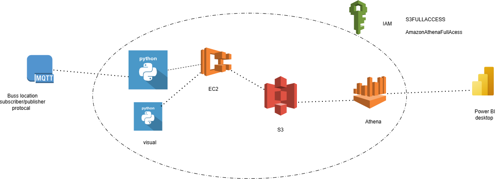
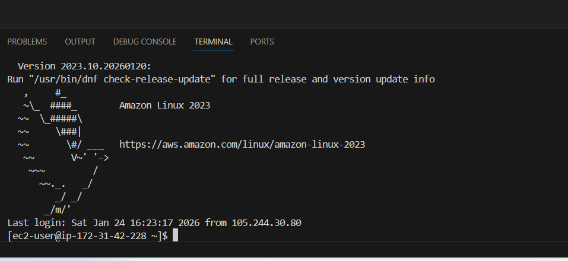
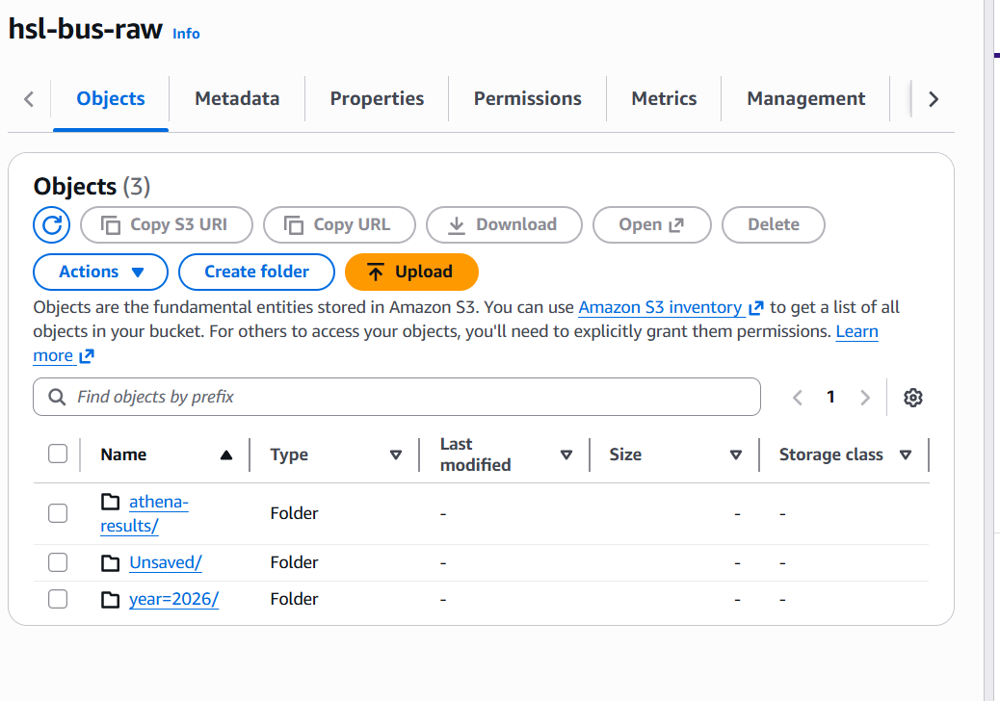
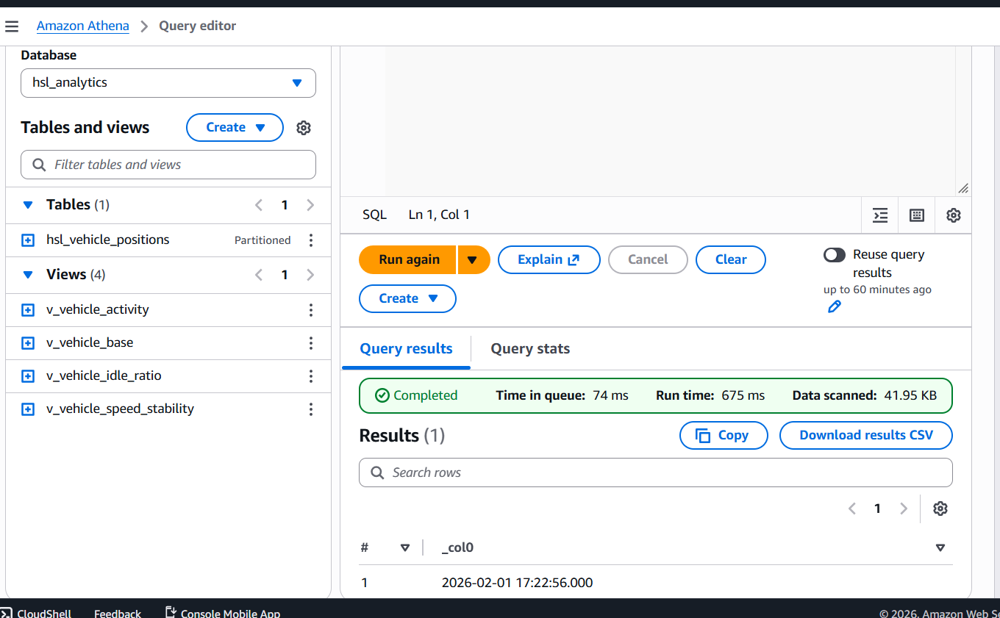
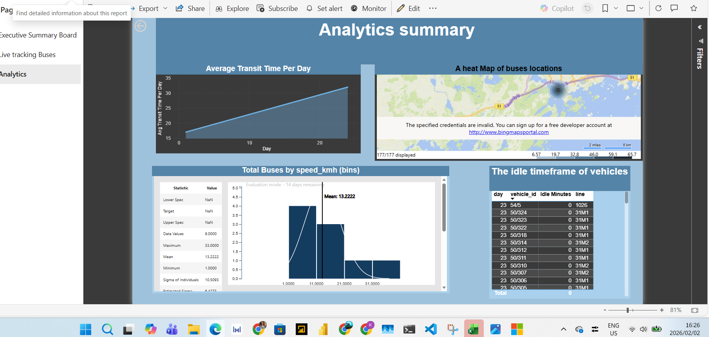
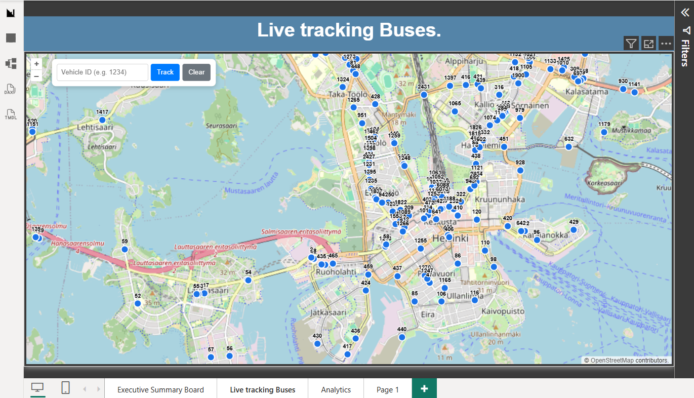

# Helsinki Live Transit: End-to-End IoT Data Engineering Pipeline

This project demonstrates a **data engineering pipeline** that ingests real-time MQTT streams from **Helsinki’s public transport system**, processes them via a **FastAPI backend on AWS EC2**, and stores historical data in an **Amazon S3 ** for **serverless analytics using Amazon Athena** and **visualization in Power BI**.

---

## Overall Data Engineering Architecture

This diagram provides a high-level view of the data flow, from real-time vehicle telemetry to analytics and visualization.



**Pipeline Flow:**  
`MQTT (IoT Source) → EC2 Ingestion & Processing → S3 Data Lake → Athena Tables & Views → Power BI`

---

## Ingestion Layer Architecture (MQTT → EC2)

This section focuses on real-time ingestion, showing how vehicle telemetry is securely consumed and processed.

### The Data Structure 

{"vehicle_id": 1537, "line": "111", "direction": "1", "latitude": 60.16433, "longitude": 24.804348, "timestamp": "2026-02-02T15:10:00.967Z", "speed": 8.16}


### Key Details
- **Protocol:** MQTT over WSS / SSL
- **Source:** HSL (Helsinki Regional Transport Authority) live positioning feed
- **Compute:** Amazon EC2
- **Process:**
  - Python-based MQTT subscriber
  - FastAPI backend for real-time SSE streaming

---

## Amazon EC2 Instance Configuration

This diagram highlights the EC2 instance setup, networking, and runtime environment.



### EC2 Responsibilities
- Hosts the FastAPI application
- Runs MQTT ingestion (`producer.py`)
- Streams real-time data to the frontend
- Batches and writes data to Amazon S3

---

## Storage Layer – Amazon S3 Data Lake Architecture

This diagram shows how raw and processed data is organized in the S3 Data Lake.



### Storage Design
- Partitioned by date and time
- Optimized for Athena querying
- Supports Parquet / CSV formats

Example structure:
```
s3://helsinki-transit-data/
 ├── raw/
 │   └── year=2026/month=01/day=25/
 └── processed/
     └── year=2026/month=01/day=25/
```


## Analytics– Amazon  Athena


The athena environment is used to turn the files to tables that we can find data through standard sturctured query langauge.
I created tables to access the vehicleid , speed, longitude, latitude and event_timestamp, from those tables I created a views to summarize the data to the specific requirement needed in the dashboard and further analysis.




---

## Project Dashboards

This dasboard is created with the purpose of highlighting the key KPIS that are needed to make decisions 
and allow for quick access to current  buses and it's location.

### Executive Dashboard


### Analytics Dashboard



### Live Bus Tracker



---

## Project UI and Results

### Real-Time Map (FastAPI and Leaflet.js)


- Server-Sent Events (SSE)
- Near real-time vehicle updates
- Interactive Leaflet.js map

---

## Tech Stack

### Languages and Frameworks
- Python (FastAPI, Pandas, Paho-MQTT)

### AWS Services
- Amazon EC2
- Amazon S3
- Amazon Athena
- AWS IAM

### DevOps and Tooling
- `nohup` for background processing
- `requirements.txt` for dependency management

### Frontend and BI
- HTML5
- Leaflet.js
- Power BI Desktop

---

## Deployment Overview

1. **Provision EC2**
   - Amazon Linux 2
   - Open ports: `80`, `8000`, `443`

2. **Configure Ingestion**
   - Run `producer.py` for MQTT ingestion
   - Enable batching to S3

3. **Create Athena Tables and Views**
   - Point to S3 Data Lake
   - Enable partitioning

4. **Connect Power BI**
   - Use Athena connector
   - Build dashboards

---

## Repository Structure

```
├── main.py                 # FastAPI streaming backend
├── producer.py             # MQTT ingestion and S3 persistence
├── index.html              # Live Leaflet.js frontend
├── images/                 # Architecture diagrams & dashboard screenshots
│   ├── architecture-overview.png
│   ├── mqtt-to-ec2.png
│   ├── ec2.png
│   ├── s3.png
│   ├── executive dashboard.png
│   ├── analytic.png
│   ├── live bus tracker.png
│   └── realtime-map.png
├── requirements.txt
└── README.md
```

---
